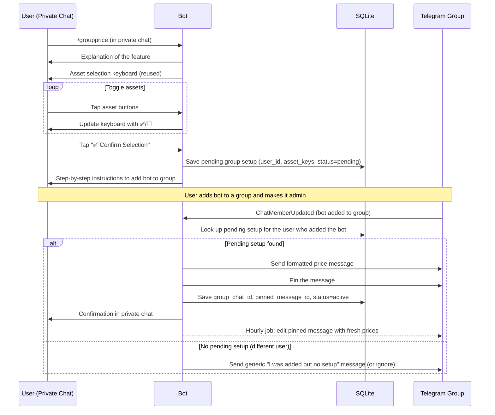
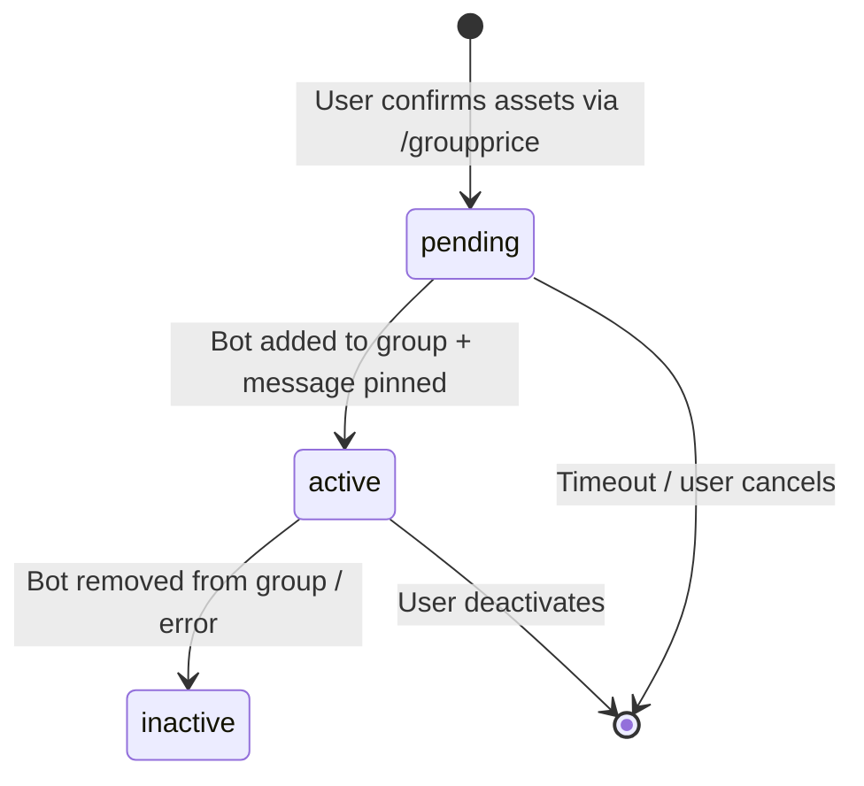
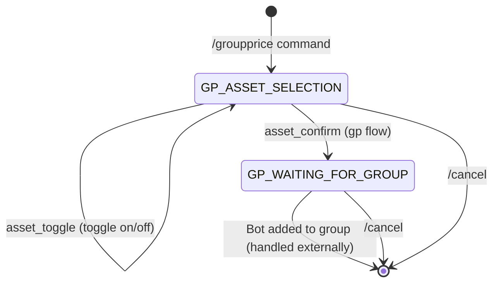
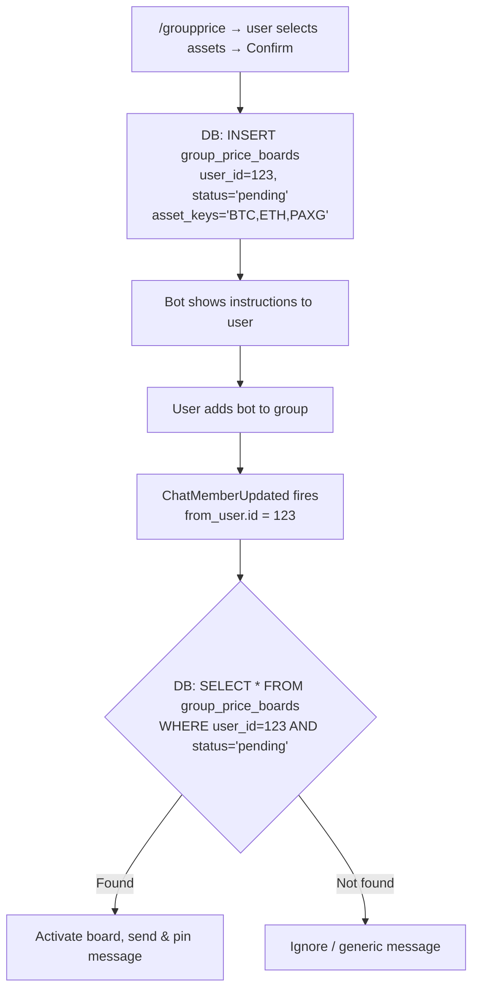

# Feature Plan: `/groupprice` — Live-Updating Pinned Price Board in Telegram Groups

## 📋 Overview

This plan describes the implementation of a new `/groupprice` command that allows users to set up a **live-updating pinned price message** in a Telegram group. The bot sends a formatted price message to the group, pins it, and edits it every hour with fresh prices.

**Test-only:** Gated behind the existing [`NEW_FLOW_USER_IDS`](bot.py:40) set (user ID `6840070959`).

---

## 🏗️ Current Architecture Context

| File | Relevant Components |
|---|---|
| [`bot.py`](bot.py) | [`build_asset_keyboard()`](bot.py:76), [`asset_toggle_handler()`](bot.py:192), [`asset_confirm_handler()`](bot.py:219), [`is_new_flow_user()`](bot.py:42), ConversationHandler pattern, [`update_price_cache_job()`](bot.py:660) |
| [`database.py`](database.py) | [`init_db()`](database.py:27), [`save_user_assets()`](database.py:229), [`get_user_assets()`](database.py:254), SQLite connection pattern |
| [`price_service.py`](price_service.py) | [`get_filtered_prices()`](price_service.py:169), [`ASSET_REGISTRY`](price_service.py:24), [`ALL_ASSET_KEYS`](price_service.py:37) |

---

## 🔄 User Flow



---

## 1️⃣ Database Schema Changes

### New Table: `group_price_boards`

```sql
CREATE TABLE IF NOT EXISTS group_price_boards (
    id INTEGER PRIMARY KEY AUTOINCREMENT,
    user_id INTEGER NOT NULL,
    group_chat_id INTEGER,
    pinned_message_id INTEGER,
    asset_keys TEXT NOT NULL,
    status TEXT NOT NULL DEFAULT 'pending',
    created_at TIMESTAMP DEFAULT CURRENT_TIMESTAMP,
    updated_at TIMESTAMP DEFAULT CURRENT_TIMESTAMP
);
```

**Column details:**

| Column | Type | Description |
|---|---|---|
| `id` | INTEGER PK | Auto-increment row ID |
| `user_id` | INTEGER | Telegram user ID who set up the board |
| `group_chat_id` | INTEGER | Telegram group chat ID (NULL while pending) |
| `pinned_message_id` | INTEGER | Message ID of the pinned price message (NULL while pending) |
| `asset_keys` | TEXT | Comma-separated asset keys, e.g. `"BTC,ETH,PAXG"` |
| `status` | TEXT | One of: `pending`, `active`, `inactive` |
| `created_at` | TIMESTAMP | Row creation time |
| `updated_at` | TIMESTAMP | Last update time |

**Status lifecycle:**


### New Database Functions in [`database.py`](database.py)

| Function | Signature | Purpose |
|---|---|---|
| `create_group_price_board` | `(user_id: int, asset_keys: list) -> int` | Insert a new row with `status='pending'`, return the row `id` |
| `get_pending_board_for_user` | `(user_id: int) -> dict or None` | Get the most recent `pending` board for a user |
| `activate_group_price_board` | `(board_id: int, group_chat_id: int, pinned_message_id: int)` | Set `status='active'`, fill in `group_chat_id` and `pinned_message_id` |
| `get_active_boards` | `() -> list[dict]` | Get all boards with `status='active'` (for hourly job restoration) |
| `get_board_by_group` | `(group_chat_id: int) -> dict or None` | Look up board by group chat ID |
| `deactivate_board` | `(board_id: int)` | Set `status='inactive'` |
| `update_pinned_message_id` | `(board_id: int, message_id: int)` | Update the pinned message ID (if re-pinning is needed) |
| `cancel_pending_boards` | `(user_id: int)` | Cancel any existing pending boards for a user (before creating a new one) |

### Schema Initialization

Add the `CREATE TABLE IF NOT EXISTS group_price_boards` statement inside the existing [`init_db()`](database.py:27) function, after the `user_asset_preferences` table creation (around line 56).

---

## 2️⃣ The `/groupprice` Command Flow

### ConversationHandler States

```python
# States for /groupprice conversation flow
GP_ASSET_SELECTION = 30
GP_WAITING_FOR_GROUP = 31
```

### State Machine



### Step-by-Step Handler Logic

#### 2.1 Entry Point: [`groupprice_command()`](bot.py)

```python
async def groupprice_command(update: Update, context: ContextTypes.DEFAULT_TYPE):
    """Handler for /groupprice — sets up a live price board in a group."""
    user_id = update.effective_user.id

    # Gate check
    if not is_new_flow_user(user_id):
        await update.message.reply_text("This command is not available yet.")
        return ConversationHandler.END

    # Only works in private chat
    if update.effective_chat.type != 'private':
        await update.message.reply_text(
            "⚠️ Please use /groupprice in a private chat with me, not in a group."
        )
        return ConversationHandler.END

    # Explain the feature
    await update.message.reply_text(
        "📌 **Group Price Board**\n\n"
        "This feature lets you set up a **live-updating pinned message** "
        "in a Telegram group that shows current market prices.\n\n"
        "**How it works:**\n"
        "1️⃣ You choose which assets to display\n"
        "2️⃣ You add me to a group and make me admin\n"
        "3️⃣ I'll send and pin a price message\n"
        "4️⃣ I'll update it every hour automatically\n\n"
        "Let's start by choosing your assets! 👇",
        parse_mode='Markdown'
    )

    # Cancel any existing pending boards for this user
    database.cancel_pending_boards(user_id)

    # Initialize asset selection — pre-populate with existing preferences or all
    existing = database.get_user_assets(user_id)
    if existing is not None:
        context.user_data['selected_assets'] = set(existing)
    else:
        context.user_data['selected_assets'] = set(ALL_ASSET_KEYS)

    # Mark flow context for shared handlers
    context.user_data['_asset_flow'] = 'groupprice'
    context.user_data['_asset_selection_state'] = GP_ASSET_SELECTION

    # Show asset selection keyboard (reuse existing)
    keyboard = build_asset_keyboard(context.user_data['selected_assets'])
    await update.message.reply_text(
        "📊 **Select assets for the group price board:**\n"
        "Tap to toggle on/off, then press Confirm.",
        reply_markup=InlineKeyboardMarkup(keyboard),
        parse_mode='Markdown'
    )
    return GP_ASSET_SELECTION
```

#### 2.2 Asset Toggle — Reuse Existing [`asset_toggle_handler()`](bot.py:192)

The existing handler already returns `context.user_data.get('_asset_selection_state', START_ASSET_SELECTION)` (line 217), so it will correctly return `GP_ASSET_SELECTION` when the flow is `groupprice`. **No changes needed** to the toggle handler.

#### 2.3 Asset Confirm — Modify Existing [`asset_confirm_handler()`](bot.py:219)

Add a new branch for `flow == 'groupprice'` inside the existing [`asset_confirm_handler()`](bot.py:219). Currently it handles `'settings'` and `'start'` flows. We add:

```python
# Inside asset_confirm_handler(), after the settings branch:

if flow == 'groupprice':
    # Save the pending board to DB
    board_id = database.create_group_price_board(user_id, list(selected))
    context.user_data['_gp_board_id'] = board_id

    # Build asset summary
    asset_names = []
    for asset in ASSET_REGISTRY:
        if asset["key"] in selected:
            asset_names.append(f"{asset['emoji']} {asset['label']}")
    asset_list = "\n".join(asset_names)

    await query.edit_message_text(
        f"✅ **{len(selected)} assets selected for group board:**\n\n"
        f"{asset_list}\n\n"
        "━━━━━━━━━━━━━━━━━━━━━\n\n"
        "📋 **Now follow these steps:**\n\n"
        "1️⃣ **Create a group** (or open an existing one)\n\n"
        "2️⃣ **Add me to the group:**\n"
        "   Search for `@notifiercrypto_ind_bot` and add me\n\n"
        "3️⃣ **Make me an admin** with these permissions:\n"
        "   • ✅ Send messages\n"
        "   • ✅ Pin messages\n\n"
        "⏳ I'm waiting for you to add me to a group...\n"
        "Once you do, I'll automatically send and pin the price board!",
        parse_mode='Markdown'
    )
    return GP_WAITING_FOR_GROUP
```

#### 2.4 State `GP_WAITING_FOR_GROUP`

This state is essentially a "dead end" in the ConversationHandler — the user doesn't interact with the bot in private chat anymore. The actual continuation happens via the `ChatMemberUpdated` handler (see Section 3). The conversation can be cancelled with `/cancel`, or it will time out.

We should add a `ConversationHandler.TIMEOUT` handler or a reasonable timeout (e.g., 30 minutes):

```python
groupprice_conv_handler = ConversationHandler(
    entry_points=[CommandHandler('groupprice', groupprice_command)],
    states={
        GP_ASSET_SELECTION: [
            CallbackQueryHandler(asset_toggle_handler, pattern=r'^asset_toggle_'),
            CallbackQueryHandler(asset_confirm_handler, pattern=r'^asset_confirm$'),
        ],
        GP_WAITING_FOR_GROUP: [
            # No handlers here — we're waiting for ChatMemberUpdated externally
            # But we need at least a timeout or a message handler to keep the conversation alive
            MessageHandler(filters.TEXT & ~filters.COMMAND, gp_waiting_reminder),
        ],
        ConversationHandler.TIMEOUT: [
            MessageHandler(filters.ALL, gp_timeout_handler),
        ],
    },
    fallbacks=[CommandHandler('cancel', cancel)],
    conversation_timeout=1800,  # 30 minutes
)
```

```python
async def gp_waiting_reminder(update: Update, context: ContextTypes.DEFAULT_TYPE):
    """Remind user we're waiting for them to add the bot to a group."""
    await update.message.reply_text(
        "⏳ I'm still waiting for you to add me to a group.\n\n"
        "Follow the steps above, and I'll automatically detect when you add me!\n\n"
        "Use /cancel to abort.",
        parse_mode='Markdown'
    )
    return GP_WAITING_FOR_GROUP

async def gp_timeout_handler(update: Update, context: ContextTypes.DEFAULT_TYPE):
    """Handle conversation timeout."""
    user_id = update.effective_user.id
    database.cancel_pending_boards(user_id)
    await update.message.reply_text(
        "⏰ Group price board setup timed out.\n"
        "Use /groupprice to start again.",
    )
    return ConversationHandler.END
```

---

## 3️⃣ Detecting Bot Added to a Group (`ChatMemberUpdated` Handler)

### How `ChatMemberUpdated` Works

The `python-telegram-bot` library (v20+) provides a [`ChatMemberHandler`](https://docs.python-telegram-bot.org/en/stable/telegram.ext.chatmemberhandler.html) that fires when the bot's membership status changes in a chat. We need to listen for `my_chat_member` updates.

**Important:** The bot must be started with `allowed_updates` that includes `"my_chat_member"`. By default, `run_polling()` may not include it. We need:

```python
application.run_polling(allowed_updates=Update.ALL_TYPES)
```

### Handler Implementation

```python
from telegram.ext import ChatMemberHandler

async def bot_added_to_group(update: Update, context: ContextTypes.DEFAULT_TYPE):
    """Handles the bot being added to a group chat."""
    # Extract the status change
    my_member = update.my_chat_member
    if my_member is None:
        return

    old_status = my_member.old_chat_member.status
    new_status = my_member.new_chat_member.status

    # We only care about transitions TO member or administrator
    if new_status not in ('member', 'administrator'):
        return

    # Ignore if old status was already member/admin (e.g., permissions change)
    if old_status in ('member', 'administrator'):
        # But DO handle member -> administrator (might now have pin permissions)
        if not (old_status == 'member' and new_status == 'administrator'):
            return

    group_chat_id = my_member.chat.id
    adder_user_id = my_member.from_user.id  # The user who added the bot

    logger.info(
        f"Bot added to group {group_chat_id} by user {adder_user_id} "
        f"(status: {old_status} -> {new_status})"
    )

    # Check if this user has a pending group price board
    pending = database.get_pending_board_for_user(adder_user_id)

    if pending is None:
        # No pending setup — either ignore or send a generic message
        logger.info(f"No pending board for user {adder_user_id}, ignoring.")
        return

    # Parse asset keys from the pending board
    asset_keys = pending['asset_keys'].split(',')

    # Try to send and pin the price message
    try:
        # Generate the price message
        price_message = format_group_price_message(asset_keys)

        # Send the message to the group
        sent_message = await context.bot.send_message(
            chat_id=group_chat_id,
            text=price_message,
            parse_mode='Markdown'
        )

        # Try to pin the message
        try:
            await context.bot.pin_chat_message(
                chat_id=group_chat_id,
                message_id=sent_message.message_id,
                disable_notification=True
            )
            pinned = True
        except Exception as pin_error:
            logger.warning(f"Could not pin message in group {group_chat_id}: {pin_error}")
            pinned = False

        # Activate the board in the database
        database.activate_group_price_board(
            board_id=pending['id'],
            group_chat_id=group_chat_id,
            pinned_message_id=sent_message.message_id
        )

        # Schedule the hourly update job
        context.job_queue.run_repeating(
            update_group_price_board_job,
            interval=3600,  # 1 hour
            first=3600,     # first update in 1 hour
            chat_id=group_chat_id,
            name=f"gp_{pending['id']}",
            data={
                'board_id': pending['id'],
                'group_chat_id': group_chat_id,
                'message_id': sent_message.message_id,
                'asset_keys': asset_keys,
            }
        )

        # Notify the user in private chat
        pin_status = "📌 Message pinned!" if pinned else "⚠️ Could not pin the message — please make me an admin with pin permissions."
        try:
            await context.bot.send_message(
                chat_id=adder_user_id,
                text=(
                    f"✅ **Group Price Board is live!**\n\n"
                    f"Group: {my_member.chat.title or 'Unknown'}\n"
                    f"{pin_status}\n\n"
                    f"The prices will update automatically every hour."
                ),
                parse_mode='Markdown'
            )
        except Exception as notify_error:
            logger.warning(f"Could not notify user {adder_user_id}: {notify_error}")

    except Exception as e:
        logger.error(f"Error setting up group price board: {e}")
        # Notify user of failure
        try:
            await context.bot.send_message(
                chat_id=adder_user_id,
                text=(
                    f"❌ **Failed to set up the price board.**\n\n"
                    f"Error: {str(e)}\n\n"
                    "Please make sure I have permission to send messages in the group.\n"
                    "Use /groupprice to try again."
                ),
                parse_mode='Markdown'
            )
        except Exception:
            pass
```

### Registration

```python
# In the main block, BEFORE run_polling:
application.add_handler(
    ChatMemberHandler(bot_added_to_group, ChatMemberHandler.MY_CHAT_MEMBER)
)
```

---

## 4️⃣ Linking Group Addition to the Configuring User

The linking mechanism works as follows:



**Key design decisions:**

1. **One pending board per user at a time.** When a user starts `/groupprice`, any existing `pending` boards for that user are cancelled first ([`cancel_pending_boards()`](database.py)).

2. **`from_user.id` in `ChatMemberUpdated`** is the user who performed the action (added the bot). This is how we link the group addition to the user who configured `/groupprice`.

3. **Race condition handling:** If the user adds the bot to multiple groups quickly, only the first one gets the pending board. Subsequent additions would find no pending board and be ignored.

4. **Timeout:** Pending boards expire after 30 minutes (conversation timeout). The DB row stays as `pending` but the conversation ends. A cleanup could be added later, or the `get_pending_board_for_user()` function could filter by `created_at` to ignore stale entries (e.g., older than 1 hour).

---

## 5️⃣ The Hourly Update Job

### Price Message Format

```python
def format_group_price_message(asset_keys: list) -> str:
    """Format the price message for a group price board."""
    # Reuse the existing filtered price formatter
    message = price_service.get_filtered_prices(asset_keys)

    # Add a footer with the last update time
    from datetime import datetime
    import pytz
    now = datetime.now(pytz.utc).strftime('%Y-%m-%d %H:%M UTC')
    message += f"\n🔄 _Last updated: {now}_"

    return message
```

### Hourly Job Function

```python
async def update_group_price_board_job(context: ContextTypes.DEFAULT_TYPE):
    """Job that edits the pinned message in a group with fresh prices."""
    job = context.job
    data = job.data
    board_id = data['board_id']
    group_chat_id = data['group_chat_id']
    message_id = data['message_id']
    asset_keys = data['asset_keys']

    try:
        # Generate fresh price message
        new_text = format_group_price_message(asset_keys)

        # Edit the existing pinned message
        await context.bot.edit_message_text(
            chat_id=group_chat_id,
            message_id=message_id,
            text=new_text,
            parse_mode='Markdown'
        )
        logger.info(f"Updated group price board {board_id} in chat {group_chat_id}")

    except telegram.error.BadRequest as e:
        error_msg = str(e).lower()
        if 'message is not modified' in error_msg:
            # Prices haven't changed — this is fine, skip silently
            logger.debug(f"Board {board_id}: message not modified (prices unchanged)")
        elif 'message to edit not found' in error_msg:
            # Message was deleted — deactivate the board
            logger.warning(f"Board {board_id}: pinned message deleted, deactivating")
            database.deactivate_board(board_id)
            job.schedule_removal()
        elif 'chat not found' in error_msg or 'bot was kicked' in error_msg:
            # Bot was removed from the group
            logger.warning(f"Board {board_id}: bot removed from group, deactivating")
            database.deactivate_board(board_id)
            job.schedule_removal()
        else:
            logger.error(f"Board {board_id}: BadRequest editing message: {e}")

    except telegram.error.Forbidden as e:
        # Bot was blocked or removed
        logger.warning(f"Board {board_id}: Forbidden — {e}, deactivating")
        database.deactivate_board(board_id)
        job.schedule_removal()

    except Exception as e:
        logger.error(f"Board {board_id}: Unexpected error updating price board: {e}")
```

### Job Restoration on Bot Restart

Add a function to restore hourly jobs from the database, called during startup alongside the existing [`restore_jobs()`](bot.py:639):

```python
async def restore_group_price_boards(context: ContextTypes.DEFAULT_TYPE):
    """Restores hourly update jobs for active group price boards on startup."""
    boards = database.get_active_boards()
    count = 0

    for board in boards:
        asset_keys = board['asset_keys'].split(',')
        context.job_queue.run_repeating(
            update_group_price_board_job,
            interval=3600,
            first=60,  # first update 1 minute after startup
            chat_id=board['group_chat_id'],
            name=f"gp_{board['id']}",
            data={
                'board_id': board['id'],
                'group_chat_id': board['group_chat_id'],
                'message_id': board['pinned_message_id'],
                'asset_keys': asset_keys,
            }
        )
        count += 1

    logger.info(f"Restored {count} group price board jobs from database.")
```

Register in the main block:

```python
# After the existing restore_jobs line:
application.job_queue.run_once(restore_group_price_boards, when=2)
```

---

## 6️⃣ Error Handling

### Error Scenarios and Responses

| Scenario | Detection | Response |
|---|---|---|
| Bot not admin / can't send messages | `Forbidden` exception on `send_message` | Notify user in private: "Make me admin with send permissions" |
| Bot can't pin messages | Exception on `pin_chat_message` | Board still activates, but user is warned: "Please give me pin permissions" |
| Pinned message deleted by group admin | `BadRequest: message to edit not found` during hourly update | Deactivate board, remove job |
| Bot removed from group | `Forbidden` or `ChatNotFound` during hourly update | Deactivate board, remove job |
| Prices unchanged (no edit needed) | `BadRequest: message is not modified` | Silently skip (not an error) |
| User sends `/groupprice` in a group | `update.effective_chat.type != 'private'` | Reply: "Please use this command in private chat" |
| User not in `NEW_FLOW_USER_IDS` | [`is_new_flow_user()`](bot.py:42) returns `False` | Reply: "This command is not available yet" |
| User starts `/groupprice` but never adds bot | Conversation timeout (30 min) | Pending board stays in DB; conversation ends |
| User runs `/groupprice` again while pending | [`cancel_pending_boards()`](database.py) | Old pending board cancelled, new one created |

### Graceful Degradation

If pinning fails but sending succeeds, the board should still be activated. The message ID is saved regardless, and hourly updates will still edit the message (even if it's not pinned). The user is notified to grant pin permissions.

---

## 7️⃣ Reusing the Existing Asset Selection Keyboard

The existing [`build_asset_keyboard()`](bot.py:76) and [`asset_toggle_handler()`](bot.py:192) are already designed to be flow-agnostic via `context.user_data`:

- **`context.user_data['_asset_flow']`** — identifies which flow is active (`'start'`, `'settings'`, or now `'groupprice'`)
- **`context.user_data['_asset_selection_state']`** — the ConversationHandler state to return to after toggling

The [`asset_toggle_handler()`](bot.py:192) at line 217 already returns:
```python
return context.user_data.get('_asset_selection_state', START_ASSET_SELECTION)
```

And [`asset_confirm_handler()`](bot.py:219) at line 235 already checks:
```python
flow = context.user_data.get('_asset_flow', 'start')
```

**Changes needed:**
1. In [`groupprice_command()`](bot.py), set `context.user_data['_asset_flow'] = 'groupprice'` and `context.user_data['_asset_selection_state'] = GP_ASSET_SELECTION` ✅ (shown in Section 2.1)
2. In [`asset_confirm_handler()`](bot.py:219), add an `elif flow == 'groupprice':` branch ✅ (shown in Section 2.3)

**No changes needed** to [`build_asset_keyboard()`](bot.py:76) or [`asset_toggle_handler()`](bot.py:192).

---

## 8️⃣ Handler Registration (Main Block)

The following changes are needed in the main block of [`bot.py`](bot.py:668):

```python
# New imports
from telegram.ext import ChatMemberHandler

# New ConversationHandler for /groupprice
groupprice_conv_handler = ConversationHandler(
    entry_points=[CommandHandler('groupprice', groupprice_command)],
    states={
        GP_ASSET_SELECTION: [
            CallbackQueryHandler(asset_toggle_handler, pattern=r'^asset_toggle_'),
            CallbackQueryHandler(asset_confirm_handler, pattern=r'^asset_confirm$'),
        ],
        GP_WAITING_FOR_GROUP: [
            MessageHandler(filters.TEXT & ~filters.COMMAND, gp_waiting_reminder),
        ],
        ConversationHandler.TIMEOUT: [
            MessageHandler(filters.ALL, gp_timeout_handler),
        ],
    },
    fallbacks=[CommandHandler('cancel', cancel)],
    conversation_timeout=1800,
)

# Register handlers (add these lines)
application.add_handler(groupprice_conv_handler)  # Before other handlers
application.add_handler(
    ChatMemberHandler(bot_added_to_group, ChatMemberHandler.MY_CHAT_MEMBER)
)

# Restore group price board jobs on startup
application.job_queue.run_once(restore_group_price_boards, when=2)

# IMPORTANT: Update run_polling to include my_chat_member updates
application.run_polling(allowed_updates=Update.ALL_TYPES)
```

---

## 9️⃣ File-by-File Change Summary

### [`database.py`](database.py)

| Change | Details |
|---|---|
| Add table creation in [`init_db()`](database.py:27) | `CREATE TABLE IF NOT EXISTS group_price_boards (...)` |
| New function `create_group_price_board()` | Insert pending board, return ID |
| New function `get_pending_board_for_user()` | Query most recent pending board for a user (within 1 hour) |
| New function `activate_group_price_board()` | Update status to active, set group_chat_id and pinned_message_id |
| New function `get_active_boards()` | Get all active boards (for job restoration) |
| New function `get_board_by_group()` | Look up board by group_chat_id |
| New function `deactivate_board()` | Set status to inactive |
| New function `cancel_pending_boards()` | Cancel existing pending boards for a user |

### [`bot.py`](bot.py)

| Change | Details |
|---|---|
| Add `GP_ASSET_SELECTION`, `GP_WAITING_FOR_GROUP` states | New conversation states (lines near existing state definitions) |
| Add `groupprice_command()` | Entry point handler for `/groupprice` |
| Modify [`asset_confirm_handler()`](bot.py:219) | Add `elif flow == 'groupprice':` branch |
| Add `gp_waiting_reminder()` | Handler for messages while waiting for group addition |
| Add `gp_timeout_handler()` | Handle conversation timeout |
| Add `bot_added_to_group()` | `ChatMemberUpdated` handler for detecting bot added to group |
| Add `format_group_price_message()` | Format price message with timestamp footer |
| Add `update_group_price_board_job()` | Hourly job to edit pinned message |
| Add `restore_group_price_boards()` | Startup job restoration |
| Add `groupprice_conv_handler` | New ConversationHandler registration |
| Add `ChatMemberHandler` registration | For `my_chat_member` updates |
| Modify [`application.run_polling()`](bot.py:738) | Add `allowed_updates=Update.ALL_TYPES` |
| Import `ChatMemberHandler` | Add to imports at top of file |

### [`price_service.py`](price_service.py)

| Change | Details |
|---|---|
| **No changes needed** | [`get_filtered_prices()`](price_service.py:169) already exists and works for this feature |

---

## 🔟 Implementation Order

Recommended implementation sequence:

```mermaid
gantt
    title Implementation Order
    dateFormat X
    axisFormat %s

    section Database
    Add group_price_boards table to init_db()     :db1, 0, 1
    Implement all new DB functions                  :db2, 1, 3

    section Bot - Command Flow
    Add GP states and groupprice_command()          :bot1, 3, 5
    Modify asset_confirm_handler() for GP flow      :bot2, 5, 6
    Add waiting/timeout handlers                    :bot3, 6, 7

    section Bot - Group Detection
    Add ChatMemberUpdated handler                   :bot4, 7, 9
    Add format_group_price_message()                :bot5, 9, 10

    section Bot - Hourly Updates
    Add update_group_price_board_job()              :bot6, 10, 12
    Add restore_group_price_boards()                :bot7, 12, 13

    section Bot - Registration
    Register all handlers and update run_polling()  :bot8, 13, 14

    section Testing
    End-to-end test with user 6840070959            :test, 14, 16
```



### Step-by-step:

1. **Database layer** — Add table + all CRUD functions in [`database.py`](database.py)
2. **`/groupprice` command** — Entry point, asset selection (reuse existing), instructions display
3. **Modify [`asset_confirm_handler()`](bot.py:219)** — Add the `groupprice` flow branch
4. **`ChatMemberUpdated` handler** — Detect bot added to group, link to pending board, send + pin message
5. **`format_group_price_message()`** — Price message with timestamp footer
6. **Hourly update job** — Edit pinned message, handle errors
7. **Job restoration** — Restore active boards on bot restart
8. **Handler registration** — Wire everything up in the main block, update `run_polling()`
9. **Test** — Full end-to-end test with user `6840070959`

---

## 1️⃣1️⃣ Future Enhancements (Out of Scope)

These are NOT part of this implementation but noted for future consideration:

- `/groupprice` management commands (list active boards, deactivate, change assets)
- Multiple boards per user (different groups, different assets)
- Configurable update interval (not just hourly)
- Group admin commands (e.g., `/boardstatus` in the group itself)
- Handling bot being promoted to admin after initial addition (re-try pinning)