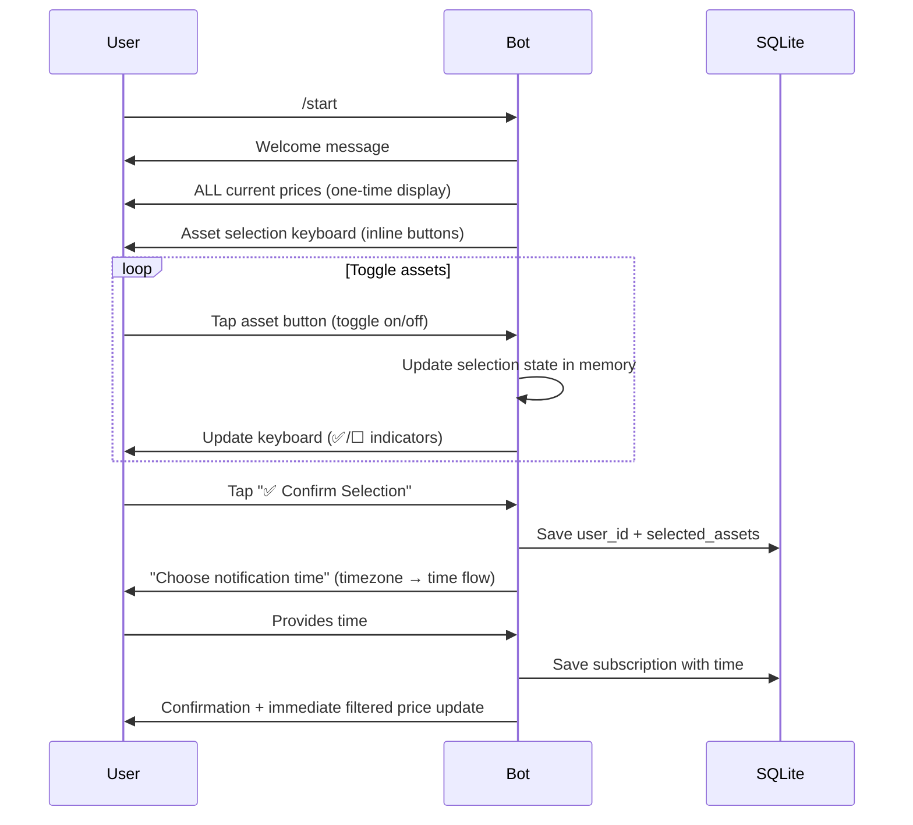
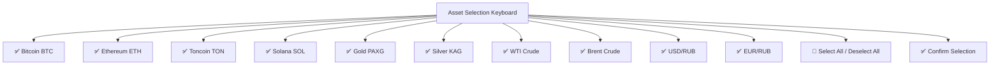
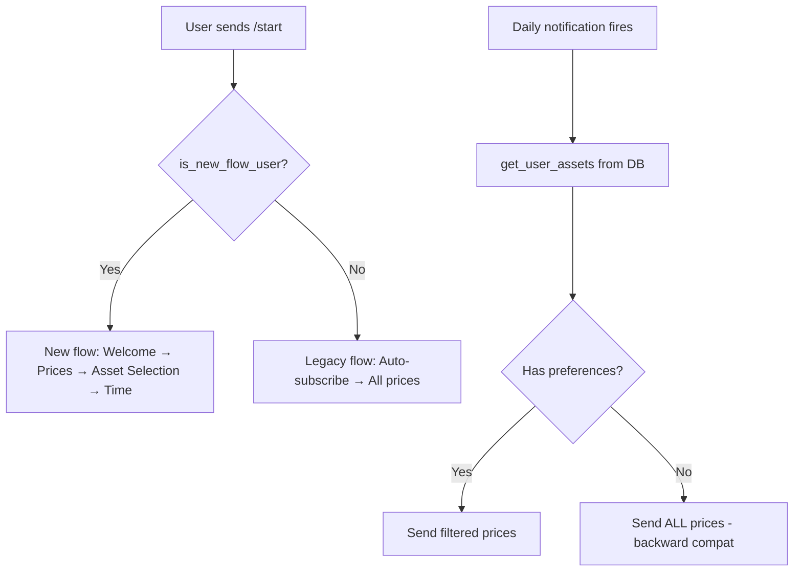

# Feature Overhaul Plan: Per-User Asset Selection for Daily Notifications

## 📋 Overview

This plan describes the changes needed to transform the Telegram Market Notifier Bot from a "subscribe to everything" model to a **per-user asset selection** model. Users will be able to choose exactly which assets (crypto, metals, oil, currencies) they want in their daily notifications.

**Test-first approach:** The new flow will initially only be active for Telegram user ID `6840070959`. All other users continue with the existing behavior until full rollout.

---

## 🏗️ Current Architecture Summary

| File | Role | Key Details |
|---|---|---|
| [`bot.py`](bot.py) | Bot logic, handlers, scheduling | `/start` auto-subscribes, sends ALL prices |
| [`database.py`](database.py) | SQLite operations | `subscriptions_v2` table — no asset preferences |
| [`price_service.py`](price_service.py) | Price fetching & formatting | `get_prices()` returns ALL assets, no filtering |

**Current `/start` flow:**
1. User sends `/start`
2. Bot auto-subscribes with current UTC time
3. Bot sends welcome message + ALL prices
4. Daily job sends ALL prices at the scheduled time

**Current DB schema (`subscriptions_v2`):**
```
id INTEGER PRIMARY KEY AUTOINCREMENT
user_id INTEGER NOT NULL
chat_id INTEGER NOT NULL
notification_time TEXT NOT NULL
timezone TEXT DEFAULT 'UTC'
created_at TIMESTAMP DEFAULT CURRENT_TIMESTAMP
```

**Tracked assets (10 total):**
| Key | Display Name | Source | Category |
|---|---|---|---|
| `BTC` | Bitcoin (BTC) | CryptoCompare | Crypto |
| `ETH` | Ethereum (ETH) | CryptoCompare | Crypto |
| `TON` | Toncoin (TON) | CryptoCompare | Crypto |
| `SOL` | Solana (SOL) | CryptoCompare | Crypto |
| `PAXG` | Gold (PAXG) | CryptoCompare | Metals |
| `KAG` | Silver (KAG) | CryptoCompare | Metals |
| `WTI` | WTI Crude | Yahoo Finance | Oil |
| `BRENT` | Brent Crude | Yahoo Finance | Oil |
| `USD_RUB` | USD/RUB | FloatRates | Currencies |
| `EUR_RUB` | EUR/RUB | FloatRates | Currencies |

---

## 🔄 New User Flow



---

## 1️⃣ Database Schema Changes

### New Table: `user_asset_preferences`

```sql
CREATE TABLE IF NOT EXISTS user_asset_preferences (
    id INTEGER PRIMARY KEY AUTOINCREMENT,
    user_id INTEGER NOT NULL,
    asset_key TEXT NOT NULL,
    enabled INTEGER NOT NULL DEFAULT 1,
    created_at TIMESTAMP DEFAULT CURRENT_TIMESTAMP,
    UNIQUE(user_id, asset_key)
);
```

**Design rationale:** One row per user per asset. This allows easy querying (`SELECT asset_key FROM user_asset_preferences WHERE user_id = ? AND enabled = 1`) and simple toggling. The `UNIQUE(user_id, asset_key)` constraint prevents duplicates.

### Migration Strategy

- **New users (test user):** Preferences are created during the new `/start` flow based on their selections.
- **Existing users:** No rows in `user_asset_preferences` → treated as "all assets selected" (backward compatible). This means `get_user_assets()` returns ALL asset keys when no preferences exist for a user.
- **No changes to `subscriptions_v2`** — it continues to store scheduling info. Asset preferences are a separate concern.

### New Database Functions in [`database.py`](database.py)

| Function | Purpose |
|---|---|
| `save_user_assets(user_id, asset_keys: list)` | Delete existing prefs for user, insert new rows for each selected asset |
| `get_user_assets(user_id) -> list[str]` | Return list of enabled asset keys for user. If no rows exist, return ALL asset keys (backward compat) |
| `has_asset_preferences(user_id) -> bool` | Check if user has any rows in the preferences table (to distinguish "selected all" from "never configured") |

### Schema Initialization

Add the `CREATE TABLE IF NOT EXISTS` for `user_asset_preferences` inside the existing [`init_db()`](database.py:27) function.

---

## 2️⃣ Asset Registry (Shared Constants)

Create a canonical asset registry used by both the UI and the price formatter. This should be defined in [`price_service.py`](price_service.py) (or a new `constants.py`, but keeping it in `price_service.py` is simpler).

```python
# In price_service.py (top of file)

ASSET_REGISTRY = [
    {"key": "BTC",     "emoji": "₿",  "label": "Bitcoin (BTC)",    "category": "Crypto"},
    {"key": "ETH",     "emoji": "💎", "label": "Ethereum (ETH)",   "category": "Crypto"},
    {"key": "TON",     "emoji": "💎", "label": "Toncoin (TON)",    "category": "Crypto"},
    {"key": "SOL",     "emoji": "☀️", "label": "Solana (SOL)",     "category": "Crypto"},
    {"key": "PAXG",    "emoji": "🟡", "label": "Gold (PAXG)",      "category": "Metals"},
    {"key": "KAG",     "emoji": "⚪", "label": "Silver (KAG)",     "category": "Metals"},
    {"key": "WTI",     "emoji": "🛢️", "label": "WTI Crude",        "category": "Oil"},
    {"key": "BRENT",   "emoji": "🛢️", "label": "Brent Crude",      "category": "Oil"},
    {"key": "USD_RUB", "emoji": "🇺🇸", "label": "USD/RUB",         "category": "Currencies"},
    {"key": "EUR_RUB", "emoji": "🇪🇺", "label": "EUR/RUB",         "category": "Currencies"},
]

ALL_ASSET_KEYS = [a["key"] for a in ASSET_REGISTRY]
```

---

## 3️⃣ Price Service Changes ([`price_service.py`](price_service.py))

### New Function: `get_filtered_prices(asset_keys: list[str]) -> str`

This function builds the formatted message including **only** the assets whose keys are in `asset_keys`.

**Implementation approach:**
1. Ensure cache is populated (same as current [`get_prices()`](price_service.py:134)).
2. Build the message dynamically by iterating over `ASSET_REGISTRY`, grouping by category, and only including assets present in `asset_keys`.
3. Skip entire category headers if no assets from that category are selected.

### Refactor Existing `get_prices()`

Refactor [`get_prices()`](price_service.py:134) to call `get_filtered_prices(ALL_ASSET_KEYS)` so the old behavior is preserved with zero duplication.

```python
def get_prices():
    """Returns formatted message with ALL assets (backward compatible)."""
    return get_filtered_prices(ALL_ASSET_KEYS)

def get_filtered_prices(asset_keys):
    """Returns formatted message with only the specified assets."""
    if _cache["last_updated"] == 0:
        update_cache()
    
    # ... build message dynamically based on asset_keys
```

### Cache Key Mapping

The cache currently uses different structures for crypto, oil, and forex. We need a mapping from asset key to cache location:

```python
def _get_asset_price_data(key):
    """Maps an asset key to its cached price data."""
    c, o, f = _cache["crypto"], _cache["oil"], _cache["forex"]
    mapping = {
        "BTC": c.get("BTC"), "ETH": c.get("ETH"),
        "TON": c.get("TON"), "SOL": c.get("SOL"),
        "PAXG": c.get("PAXG"), "KAG": c.get("KAG"),
        "WTI": o.get("WTI"), "BRENT": o.get("Brent"),
        "USD_RUB": f.get("USD"), "EUR_RUB": f.get("EUR"),
    }
    return mapping.get(key)
```

---

## 4️⃣ Bot Changes ([`bot.py`](bot.py))

### 4.1 Test Mode Gate

Define a constant at the top of [`bot.py`](bot.py):

```python
# Test user IDs that get the new flow
NEW_FLOW_USER_IDS = {6840070959}

def is_new_flow_user(user_id: int) -> bool:
    return user_id in NEW_FLOW_USER_IDS
```

When ready for full rollout, simply change to `return True`.

### 4.2 New `/start` Handler

Replace the current [`start()`](bot.py:45) function with branching logic:

```python
async def start(update, context):
    user_id = update.effective_user.id
    chat_id = update.effective_chat.id
    
    if is_new_flow_user(user_id):
        await start_new_flow(update, context)
    else:
        await start_legacy_flow(update, context)
```

- **`start_legacy_flow()`** — contains the current auto-subscribe behavior (copy of existing code).
- **`start_new_flow()`** — implements the new interactive flow.

### 4.3 New `/start` Flow Implementation

**ConversationHandler states:**

```python
# New states for the /start conversation
(START_ASSET_SELECTION, START_CONFIRM_ASSETS, 
 START_SELECT_TIMEZONE, START_SELECT_TIME) = range(10, 14)
```

**Step 1: Welcome + Show All Prices + Asset Selection Keyboard**

```python
async def start_new_flow(update, context):
    chat_id = update.effective_chat.id
    
    # Send welcome
    await update.message.reply_text(
        "👋 **Welcome to the Market Notifier Bot!**\n\n"
        "Here are the current market prices:"
    )
    
    # Send ALL prices (one-time, informational)
    await send_price_update(chat_id, context)
    
    # Initialize selection state (all selected by default)
    context.user_data['selected_assets'] = set(ALL_ASSET_KEYS)
    
    # Show asset selection keyboard
    keyboard = build_asset_keyboard(context.user_data['selected_assets'])
    await update.message.reply_text(
        "📌 **Choose which assets you want in your daily update:**\n"
        "Tap to toggle on/off, then press Confirm.",
        reply_markup=InlineKeyboardMarkup(keyboard)
    )
    return START_ASSET_SELECTION
```

### 4.4 Asset Selection Inline Keyboard



**Keyboard layout** (2 columns for assets, full-width for actions):

```python
def build_asset_keyboard(selected: set) -> list:
    """Builds inline keyboard with toggle indicators."""
    keyboard = []
    row = []
    for asset in ASSET_REGISTRY:
        check = "✅" if asset["key"] in selected else "☐"
        btn = InlineKeyboardButton(
            f"{check} {asset['emoji']} {asset['label']}",
            callback_data=f"asset_toggle_{asset['key']}"
        )
        row.append(btn)
        if len(row) == 2:
            keyboard.append(row)
            row = []
    if row:
        keyboard.append(row)
    
    # Select All / Deselect All
    all_selected = len(selected) == len(ASSET_REGISTRY)
    toggle_text = "☐ Deselect All" if all_selected else "✅ Select All"
    keyboard.append([InlineKeyboardButton(toggle_text, callback_data="asset_toggle_all")])
    
    # Confirm button (only if at least 1 selected)
    if selected:
        keyboard.append([InlineKeyboardButton("✅ Confirm Selection", callback_data="asset_confirm")])
    
    return keyboard
```

### 4.5 Toggle Handler

```python
async def asset_toggle_handler(update, context):
    query = update.callback_query
    await query.answer()
    
    selected = context.user_data.get('selected_assets', set())
    data = query.data
    
    if data == "asset_toggle_all":
        if len(selected) == len(ASSET_REGISTRY):
            selected.clear()
        else:
            selected = set(ALL_ASSET_KEYS)
    else:
        key = data.replace("asset_toggle_", "")
        if key in selected:
            selected.discard(key)
        else:
            selected.add(key)
    
    context.user_data['selected_assets'] = selected
    keyboard = build_asset_keyboard(selected)
    await query.edit_message_reply_markup(reply_markup=InlineKeyboardMarkup(keyboard))
    return START_ASSET_SELECTION
```

### 4.6 Confirm Handler → Timezone/Time Selection

When the user taps "Confirm Selection":

```python
async def asset_confirm_handler(update, context):
    query = update.callback_query
    await query.answer()
    
    selected = context.user_data.get('selected_assets', set())
    if not selected:
        await query.answer("Please select at least one asset!", show_alert=True)
        return START_ASSET_SELECTION
    
    # Save assets to DB
    user_id = query.from_user.id
    database.save_user_assets(user_id, list(selected))
    
    # Proceed to timezone selection (reuse existing timezone keyboard)
    keyboard = build_timezone_keyboard()  # extracted from existing add_sub_start
    await query.edit_message_text(
        f"✅ **{len(selected)} assets selected!**\n\n"
        "🌍 **Now choose your timezone:**",
        reply_markup=InlineKeyboardMarkup(keyboard)
    )
    return START_SELECT_TIMEZONE
```

The timezone → time flow reuses the existing logic from [`timezone_selected()`](bot.py:133) and [`time_received()`](bot.py:149), adapted for the new conversation states.

### 4.7 Updated ConversationHandler

A new `ConversationHandler` for the `/start` command (only for new-flow users):

```python
start_conv_handler = ConversationHandler(
    entry_points=[CommandHandler('start', start)],
    states={
        START_ASSET_SELECTION: [
            CallbackQueryHandler(asset_toggle_handler, pattern='^asset_toggle_'),
            CallbackQueryHandler(asset_confirm_handler, pattern='^asset_confirm$'),
        ],
        START_SELECT_TIMEZONE: [
            CallbackQueryHandler(start_timezone_selected, pattern='^tz_'),
        ],
        START_SELECT_TIME: [
            MessageHandler(filters.TEXT & ~filters.COMMAND, start_time_received),
        ],
    },
    fallbacks=[CommandHandler('cancel', cancel)],
)
```

**Important:** This replaces the current `CommandHandler('start', start)`. The legacy flow is handled inside the `start()` function itself — if the user is not a new-flow user, it runs the old logic and returns `ConversationHandler.END`.

### 4.8 Modified Daily Notification Job

Update [`send_daily_notification_job()`](bot.py:214) to fetch user preferences:

```python
async def send_daily_notification_job(context):
    job = context.job
    chat_id = job.chat_id
    user_id = job.data
    
    # Get user's asset preferences
    asset_keys = database.get_user_assets(user_id)
    
    # Get filtered prices
    message = price_service.get_filtered_prices(asset_keys)
    await context.bot.send_message(chat_id=chat_id, text=message, parse_mode='Markdown')
```

Since `get_user_assets()` returns ALL assets when no preferences exist, existing users are unaffected.

---

## 5️⃣ Test Mode Implementation Strategy



**Rollout steps:**
1. Deploy with `NEW_FLOW_USER_IDS = {6840070959}`
2. Test user goes through new flow, verifies asset selection works
3. Verify daily notifications are filtered correctly for test user
4. Verify other users are completely unaffected
5. Change to `return True` in `is_new_flow_user()` for full rollout

---

## 6️⃣ File-by-File Change Summary

### [`database.py`](database.py)

| Change | Details |
|---|---|
| Add table creation in [`init_db()`](database.py:27) | `CREATE TABLE IF NOT EXISTS user_asset_preferences (...)` |
| New function `save_user_assets()` | Delete + insert pattern for atomic preference updates |
| New function `get_user_assets()` | Returns asset keys list; falls back to ALL if no prefs |
| New function `has_asset_preferences()` | Boolean check for migration/compat logic |

### [`price_service.py`](price_service.py)

| Change | Details |
|---|---|
| Add `ASSET_REGISTRY` constant | Canonical list of all assets with metadata |
| Add `ALL_ASSET_KEYS` constant | Convenience list of all keys |
| Add `get_filtered_prices(asset_keys)` | Builds message for subset of assets |
| Add `_get_asset_price_data(key)` | Maps asset key → cache data |
| Refactor [`get_prices()`](price_service.py:134) | Delegate to `get_filtered_prices(ALL_ASSET_KEYS)` |

### [`bot.py`](bot.py)

| Change | Details |
|---|---|
| Add `NEW_FLOW_USER_IDS` constant | Set of test user IDs |
| Add `is_new_flow_user()` helper | Gate function for new flow |
| Split [`start()`](bot.py:45) | Branch into `start_new_flow()` / `start_legacy_flow()` |
| Add `build_asset_keyboard()` | Generates inline keyboard with toggle state |
| Add `asset_toggle_handler()` | Handles asset on/off toggling |
| Add `asset_confirm_handler()` | Saves preferences, transitions to time selection |
| Add new ConversationHandler | For the full `/start` → asset selection → time flow |
| Modify [`send_daily_notification_job()`](bot.py:214) | Fetch user prefs, use `get_filtered_prices()` |
| Extract `build_timezone_keyboard()` | Reusable timezone keyboard builder (from existing [`add_sub_start()`](bot.py:111)) |

---

## 7️⃣ Migration Strategy for Existing Users

| Scenario | Behavior |
|---|---|
| Existing user, no asset preferences in DB | `get_user_assets()` returns ALL assets → no change in notifications |
| Existing user sends `/start` again (not test user) | Legacy flow runs → re-subscribes as before |
| Existing user sends `/start` again (after full rollout) | New flow runs → they can now customize assets |
| Test user sends `/start` | New flow → selects assets → creates subscription |
| Test user already has a subscription | New `/start` should handle gracefully (update preferences, keep or replace subscription time) |

**No data migration needed.** The absence of rows in `user_asset_preferences` is interpreted as "all assets selected."

---

## 8️⃣ Edge Cases & Considerations

1. **User taps `/start` multiple times:** The new flow should be idempotent. If user already has preferences, pre-populate the keyboard with their existing selections.

2. **Conversation timeout:** If user starts asset selection but never confirms, no subscription is created. Use `ConversationHandler` timeout or fallback.

3. **`/subscriptions` command for new-flow users:** Should show which assets are selected. Consider adding an "Edit Assets" button to the subscriptions view.

4. **Message length:** Even with all 10 assets, the message fits well within Telegram's 4096 character limit.

5. **Callback data size:** Telegram limits callback data to 64 bytes. Our longest callback data is `asset_toggle_USD_RUB` (21 chars) — well within limits.

6. **Job name uniqueness:** Current code uses `str(user_id)` as job name. If a user has multiple subscriptions, this could conflict. Not a new issue, but worth noting.

---

## 9️⃣ Implementation Order

```mermaid
gantt
    title Implementation Order
    dateFormat X
    axisFormat %s
    
    section Database
    Add user_asset_preferences table    :1, 2
    Add save/get/has functions           :2, 3
    
    section Price Service
    Add ASSET_REGISTRY constant          :3, 4
    Add get_filtered_prices()            :4, 5
    Refactor get_prices()                :5, 6
    
    section Bot - Core
    Add test mode gate                   :6, 7
    Split start() handler               :7, 8
    
    section Bot - Asset Selection UI
    Build asset keyboard                 :8, 9
    Toggle handler                       :9, 10
    Confirm handler                      :10, 11
    
    section Bot - Time Flow
    Wire timezone/time into new conv     :11, 12
    New ConversationHandler              :12, 13
    
    section Bot - Notifications
    Update daily job for filtering       :13, 14
    
    section Testing
    Test with user 6840070959            :14, 15
```



**Recommended step-by-step:**

1. **`database.py`** — Add table + new functions (no breaking changes)
2. **`price_service.py`** — Add `ASSET_REGISTRY`, `get_filtered_prices()`, refactor `get_prices()`
3. **`bot.py`** — Add test mode gate + split `/start` handler
4. **`bot.py`** — Implement asset selection keyboard + handlers
5. **`bot.py`** — Wire up timezone/time flow in new ConversationHandler
6. **`bot.py`** — Update `send_daily_notification_job()` to use filtered prices
7. **Test** — Verify with user ID `6840070959`
8. **Rollout** — Change `is_new_flow_user()` to `return True`